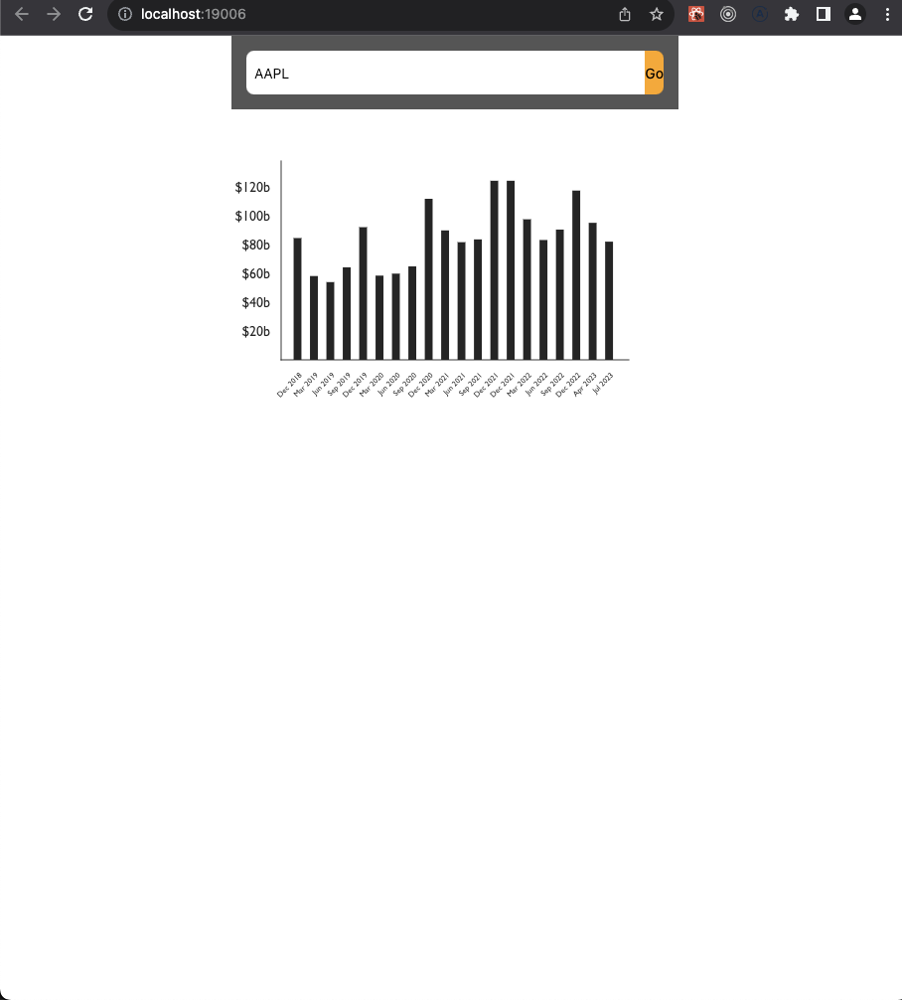

## quote-checker frontend

A spa which can showcase a ticker's(stock, etf, crypto) past performance in graphical format.
A spa containing a search bar and victory graph.
It allows showcasing a company's past performance quarterly using the graphQL api from its own backend [quote-checker-be](https://github.com/codeForMobile/quote-checker-be) and iexjs cloud data provider.

#### Creating a new project

- Install the CLI: `npm i -g expo-cli`
- Create a project: `npx create-react-native-app -t with-typescript`

#### How to run it?

execute `npm run dev` and select `w` to view it in web

#### Next steps

Will amend ui

#### how it looks

